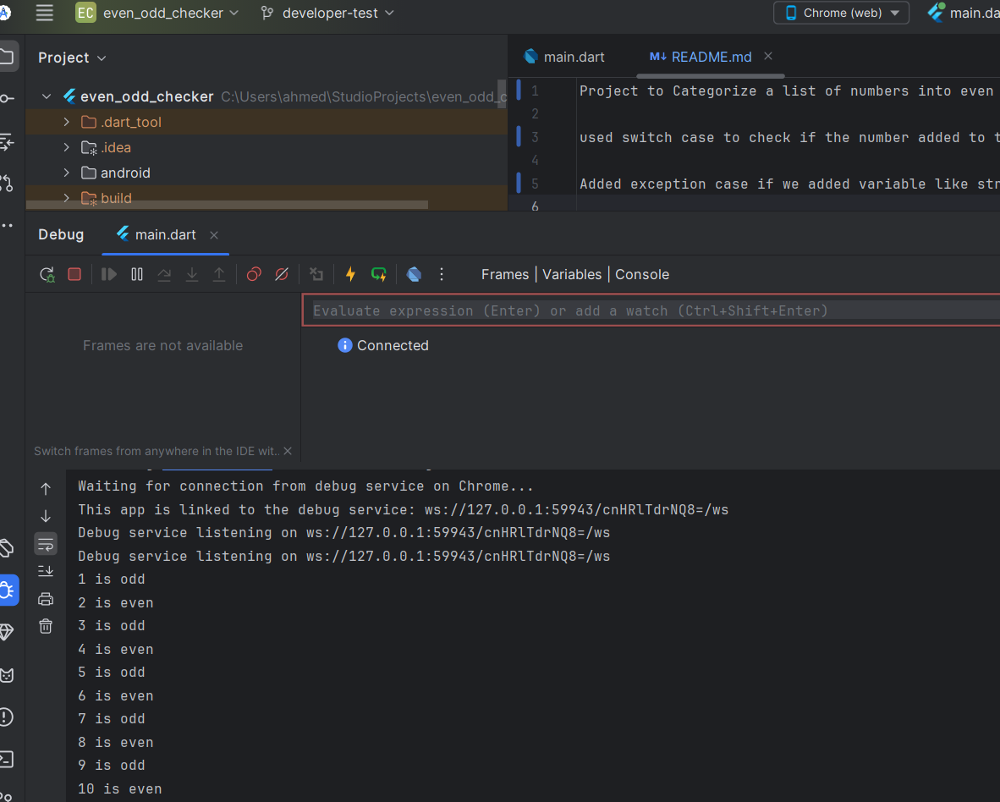

Project to Categorize a list of numbers into even or odd using for loop and switch case

used switch case to check if the number added to the list are even or odd

Added exception case if we added variables like string or non-number to the list as extra and for sure after we change int in the list to dynamic or string.

A screenshot for the output of the project

